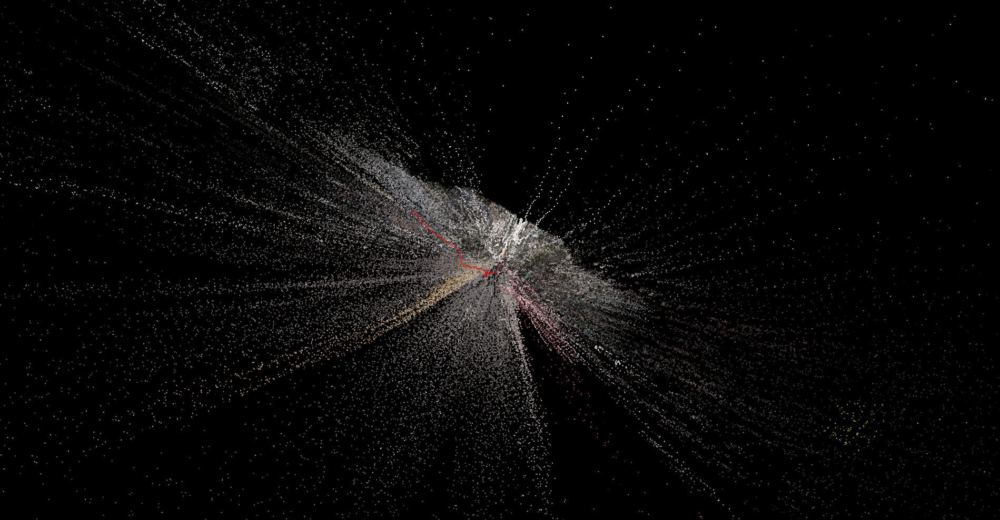
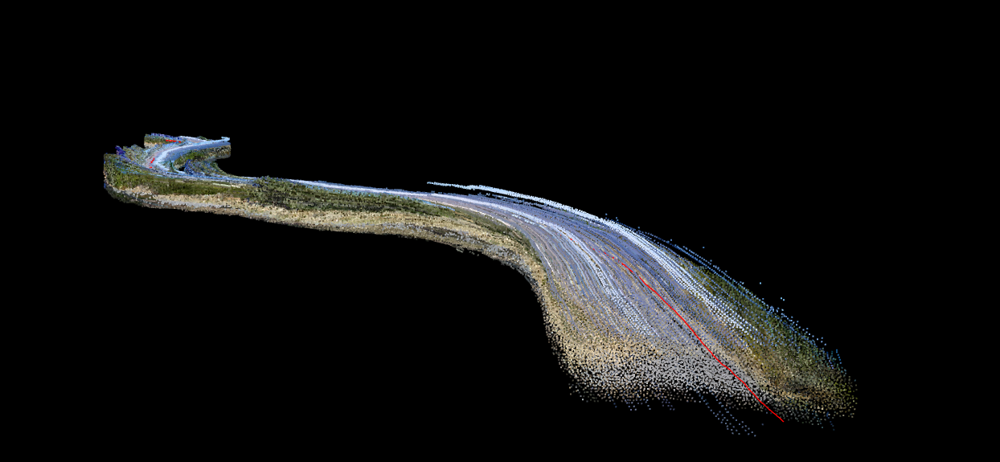

Lightweight monocular SLAM with OpenCV and Open3d for visualization

## Dependencies
```bash
pip install numpy opencv-contrib-python open3d
```

## Usage

```bash
#examples
# focal length 500 and 3d with colors
F=500 COLORS=1 python3 slam.py videos/test_countryroad.mp4

# focal length 270 (default) open3d window detached and 3d in rgb green; keyframes with pose matrix ON
O3D_OUT=1 KF=1 python3 slam.py videos/city_tram.mp4
```

|  Params        | Description                                                                                |
| -------------- | ------------------------------------------------------------------------------------------ |
| `F=500`        | Sets focal length (default: `270`)                                                         |
| `COLORS=1`     | Enables colorized point cloud instead of default green                                     |
| `O3D_OUT=1`    | Displays Open3D window separately                                                          |
| `DETECTOR=ORB` | Uses ORB instead of default GFTT + BRIEF for feature detection                             |
| `KF=1`         | Shows keyframes as wireframe frustum squares                                                        |
| `F_MASK=0.7`   | Uses only bottom 70% of the image for feature detection, negative values use top portion   |
| `SKY_AUTO=1`   | Auto-skips top 40% if features are detected above (like clouds)                            |

### WSL2 Fix
```bash
export XDG_SESSION_TYPE=x11
```


